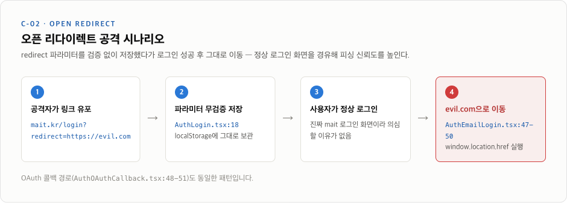

# MAIT Frontend 문제점 종합 리포트

> mait-frontend 저장소 전체를 대상으로 타입체크·린트·프로덕션 빌드·의존성 감사를 직접 실행하고, 아키텍처·보안·설정을 정적 분석한 결과입니다. 발견된 문제 14건을 심각도 3단계로 분류하고 처리 순서를 제안합니다.

| 항목 | 값 |
|---|---|
| 조사일 | 2026-07-06 |
| 브랜치 | `develop` @ `73c31a4` (v260703.1) |
| 검사 파일 | 499개 (TS/TSX 469) |
| GitHub 오픈 이슈 | 0건 |

## 핵심 지표

| 지표 | 값 | 비고 |
|---|---|---|
| 타입 에러 (`tsc --noEmit`) | **15건** | 이 중 4건은 실제 동작 버그 |
| 의존성 취약점 | **26건** | HIGH 14 · MODERATE 12 |
| 테스트 코드 | **0개** | 러너 설정·스크립트도 없음 |
| 메인 번들 크기 | **2.2 MB** | 전송 기준 약 1.5 MB |
| Biome 위반 | **128건** | 에러 73 · 경고 55 |
| lint/ts 억제 주석 | **66곳** | 파일 전체 억제 4개 파일 포함 |

## 발견 문제 14건 — 심각도별 목차

| 심각도 | ID | 제목 |
|---|---|---|
| 🔴 심각 | [C-01](#c-01-액세스-토큰이-localstorage에-평문-저장) | 액세스 토큰 localStorage 저장 |
| 🔴 심각 | [C-02](#c-02-오픈-리다이렉트) | 오픈 리다이렉트 취약점 |
| 🔴 심각 | [C-03](#c-03-ci-품질-게이트-부재--배포-버그) | CI 품질 게이트 부재 + 배포 버그 |
| 🔴 심각 | [C-04](#c-04-tsc---noemit-에러-15건) | 타입 에러 15건 (버그 4건) |
| 🔴 심각 | [C-05](#c-05-테스트-인프라-전무) | 테스트 인프라 전무 |
| 🟠 높음 | [H-01](#h-01-biome-설정-파일이-무시됨) | Biome 설정 파일이 무시됨 |
| 🟠 높음 | [H-02](#h-02-의존성-취약점-26건) | 의존성 취약점 26건 |
| 🟠 높음 | [H-03](#h-03-죽은-의존성파일-8종) | 죽은 의존성·파일 8종 |
| 🟠 높음 | [H-04](#h-04-메인-번들-22-mb) | 메인 번들 2.2 MB |
| 🟡 중간 | [M-01](#m-01-api-접근-패턴이-4갈래로-분열) | API 접근 패턴 4갈래 분열 |
| 🟡 중간 | [M-02](#m-02-레이어-위반--공용-레이어가-도메인을-역참조) | 레이어 위반 (공용→도메인) |
| 🟡 중간 | [M-03](#m-03-300줄-이상-거대-파일-11개) | 300줄 이상 거대 훅 11개 |
| 🟡 중간 | [M-04](#m-04-중복-구현) | 중복 구현 (카드·훅·네비) |
| 🟡 중간 | [M-05](#m-05-기타-정리-대상) | 기타 정리 대상 |

---

## 🔴 심각 — 보안 침해 또는 배포 사고로 직결되는 문제

### C-01. 액세스 토큰이 localStorage에 평문 저장
**XSS 한 번이면 계정 탈취**

액세스 토큰을 `localStorage.setItem("token", ...)`으로 저장하고 있어 페이지에서 실행되는 모든 JavaScript가 토큰을 읽을 수 있습니다. 리프레시 토큰은 `credentials: "include"`로 httpOnly 쿠키로 다루면서 액세스 토큰만 노출되는 **반쪽짜리 방어** 상태입니다. WebSocket 연결 헤더에도 같은 토큰이 실립니다.

**권장:** 액세스 토큰은 메모리(모듈 스코프 변수 또는 상태)에만 보관하고, 새로고침 시 리프레시 쿠키로 재발급하는 구조로 전환.

```
src/libs/api/client.ts:88-94
src/hooks/useAuth.ts:32
src/domains/auth/pages/AuthOAuthCallback.tsx:46
src/domains/solving/hooks/live/useSolvingLiveWebSocket.ts:49
```

### C-02. 오픈 리다이렉트
**로그인 후 임의의 외부 사이트로 이동 가능**

`redirect` 쿼리 파라미터를 아무 검증 없이 저장했다가 로그인 성공 직후 `window.location.href`로 그대로 이동시킵니다. 정상 로그인 페이지를 경유하므로 피싱 링크의 신뢰도를 높여주는 취약점입니다.

**공격 시나리오**



> OAuth 콜백 경로(`AuthOAuthCallback.tsx:48-51`)도 동일한 패턴입니다.

**권장:** `/`로 시작하는 내부 경로만 허용(프로토콜·호스트 포함 시 기본 경로로 대체)하는 검증 함수를 저장·사용 양쪽에 적용.

```
src/domains/auth/pages/AuthLogin.tsx:18-20
src/domains/auth/components/AuthEmailLogin.tsx:47-50
src/domains/auth/pages/AuthOAuthCallback.tsx:48-51
```

### C-03. CI 품질 게이트 부재 + 배포 버그
**타입 에러가 그대로 운영 배포됨**

배포 워크플로는 push가 오면 **빌드해서 S3에 올리는 것이 전부**입니다. 타입체크·린트·테스트 단계가 없어서 아래 C-04의 에러 15건이 매 배포마다 통과하고 있습니다.

**현재 배포 파이프라인** (`.github/workflows/deploy.yml`) — `[빠짐]` = 없는 단계

```
push (main/develop)
  └▶ pnpm install (--frozen-lockfile 없음, 락파일 드리프트 위험)
       └▶ [빠짐] typecheck · lint · test  ← 단계 자체가 없음
            └▶ pnpm build (에러 무관 통과)
                 └▶ S3 + CloudFront (운영 반영)
```

**추가로 확인된 워크플로 버그:**
- **dev 환경변수 버그** — `deploy.yml:42-43`에서 `PUBLIC_QUESTION_ID`, `PUBLIC_TEAM_ID`를 `secrets.*`가 아닌 셸 변수로 참조해 develop 빌드에서는 **항상 빈 값**이 들어감 (main은 52-53행에서 정상 참조)
- AWS 자격증명이 장기 액세스 키 방식 — OIDC 미사용
- `pnpm/action-setup` 버전이 워크플로마다 다름 (v2 vs v4)

```
.github/workflows/deploy.yml:33
.github/workflows/deploy.yml:42-43
.github/workflows/deploy.yml:55-56
```

### C-04. tsc --noEmit 에러 15건
**이 중 4건은 실제 동작 버그**

`package.json`에 typecheck 스크립트 자체가 없어 아무도 이 에러를 보지 못하는 구조입니다. 미사용 변수류 11건을 제외한 **실제 버그 4건**:

| 위치 | 내용 | 사용자 영향 |
|---|---|---|
| `SolvingReview.tsx:348` | `SolvingSubmitResult`의 필수 prop `timeGap` 누락 | 복습 모드 제출 결과 애니메이션 타이밍 이상 |
| `ManagementQuestionSetCard…Button.tsx:35` | 삭제 확인 문구 Record에 `MAKING` 상태 키 누락 | 제작 중 문제셋 삭제 시 확인 문구가 `undefined` |
| `SolvingQuizContentShortAnswer.tsx:1` | 존재하지 않는 모듈 `@/types` import | 해당 타입이 전부 `any`로 무력화 |
| `InviteBlueLetter.tsx:8` / `InviteRedLetter.tsx:8` | props를 받지 않는 컴포넌트에 `className` 전달 | 초대장 스타일이 조용히 미적용 |

### C-05. 테스트 인프라 전무

`*.test.*` / `*.spec.*` 파일 0개, vitest·jest 등 러너 설정 없음, `test` 스크립트 없음. 469개 TS/TSX 파일 규모에서 회귀를 잡을 수단이 수동 QA뿐입니다. 문제 풀이 제출 로직(`solvingBuildSubmitData.ts`), 토큰 재발급(`client.ts`) 같은 순수 로직부터 vitest 도입을 권장합니다.

---

## 🟠 높음 — 품질 체계가 무력화되어 있거나 방치된 위험

### H-01. Biome 설정 파일이 무시됨

설정 파일명이 `.biome.json`인데 Biome v2는 `biome.json` / `biome.jsonc`만 자동 인식합니다. 즉 **린트·포맷이 전부 기본값으로 동작 중**입니다.

- **증거:** 설정은 `quoteStyle: "single"` + 2칸 들여쓰기인데, 실제 코드 전체는 Biome 기본값인 큰따옴표 + 탭
- 설정의 `$schema`도 1.0.0으로, 설치된 2.x와 불일치
- 현재 Biome 위반 128건(에러 73 · 경고 55): `useExhaustiveDependencies` 4, `noDuplicateProperties` 2, `useGenericFontNames` 54 등

**권장:** `biome.json`으로 개명 후 실제 코드 스타일(큰따옴표·탭)에 맞게 설정을 수정하고, 스키마를 2.x로 갱신.

```
.biome.json:12
.biome.json:15
```

### H-02. 의존성 취약점 26건
**`pnpm audit --prod` 심각도 분포: HIGH 14 · MODERATE 12**

| 원인 패키지 | 문제 | 조치 |
|---|---|---|
| **react-router** | XSS via Open Redirects (HIGH) | 패치 버전으로 업데이트 |
| **http-proxy-middleware** | CRLF 주입 (HIGH) | 코드에서 미사용, **제거하면 끝** |
| **react-lottie 레거시 체인** | deprecated `request`·`core-js@2`·구버전 glob/minimatch를 통째로 견인 | `lottie-react`로 교체 |
| **sockjs-client · tiptap 경유** | markdown-it ReDoS, linkify-it 등 | 개별 업데이트 |

> 26건은 의존 경로 기준 집계로, 원인 패키지 수는 더 적습니다. 상당수가 위 4개 원인으로 수렴합니다.

### H-03. 죽은 의존성·파일 8종
**지우기만 하면 되는 부채**

| 대상 | 상태 | 조치 |
|---|---|---|
| `install` (npm 패키지) | 오타로 설치된 잔재, import 0건 | 제거 |
| `lodash.merge` | import 0건 | 제거 |
| `http-proxy-middleware` | import 0건 + HIGH 취약점 보유 | 제거 |
| `@types/sockjs-client` | dependencies에 위치 | devDependencies로 이동 |
| `tailwind.config.ts` | `.js`와 바이트 단위 동일한 복사본, 미사용 | 제거 |
| `src/globals.css` | 어디서도 import 안 됨, v4 문법(설치는 v3.4) | 제거 + `components.json` 경로 정리 |
| `@/apis` alias | `src/apis` 디렉토리가 존재하지 않음 | tsconfig·rsbuild에서 제거 |
| `react-toastify` + `sonner` | 토스트 라이브러리 2개가 App.tsx에서 동시 렌더 | 하나로 통일 |

### H-04. 메인 번들 2.2 MB
**첫 방문 로딩의 병목**

페이지 단위 lazy loading은 되어 있지만, tiptap·framer-motion·lottie 등 무거운 라이브러리가 진입 청크에 몰려 있습니다.

**rsbuild 프로덕션 빌드 — JS 청크 크기 (원본 기준)**

```
index.js (진입)  ████████████████████████████████████  2,205 kB
925.js           █████████████                            790 kB
async/321.js     █████                                    310 kB
lib-react.js     ███                                      183 kB
async/333.js     ██                                       112 kB
lib-router.js    █                                         81 kB
```

> 전체 산출물 5.6 MB · 진입 청크가 JS의 절반 이상 · 이미지 중 cube.png 단독 726 kB

**권장:** 번들 분석기(`@rsbuild/plugin-bundle-analyze`)로 진입 청크 구성 확인 → 에디터·애니메이션 라이브러리를 사용 라우트로 분리, cube.png 등 대형 이미지 최적화.

---

## 🟡 중간 — 구조·일관성, 유지보수 비용을 키우는 문제

### M-01. API 접근 패턴이 4갈래로 분열

`src/libs/api`의 기반(openapi-fetch + 토큰 재발급 미들웨어)은 잘 만들어져 있지만, 소비하는 방식이 통일되어 있지 않습니다:

| 호출 방식 | 사용 범위 | 비고 |
|---|---|---|
| `apiHooks.useQuery/useMutation` | 대부분 (useQuery 33곳 · useMutation 39곳) | 훅 안에 인라인 — 키 관리 분산 |
| `apiHooks.queryOptions` 팩토리 | dashboard 도메인만 | **권장 패턴** — 이쪽으로 표준화 |
| `apiClient` 명령형 직접 호출 | 14개 파일 | react-query 캐시 우회 |
| raw `fetch()` | 로그인 (`useAuth.ts`) | 타입 안전성·공용 미들웨어 모두 상실 |

전역 에러 처리도 없어 27곳에서 개별 try/catch로 대응 중이며, 401 재발급 로직은 `"A-003"` 매직 스트링에 의존합니다. QueryClient 레벨 에러 콜백 도입을 권장합니다.

```
src/hooks/useAuth.ts
src/libs/api/client.ts:68
src/domains/dashboard/queries/
```

### M-02. 레이어 위반 — 공용 레이어가 도메인을 역참조

의존 방향은 **도메인 → 공용**이어야 하는데, 공용 훅·컴포넌트·스토어가 특정 도메인의 라우트 상수와 타입을 import하고 있어 재사용성이 깨져 있습니다.

| 공용 레이어 (참조하는 쪽) | → | 도메인 레이어 (참조 대상) |
|---|---|---|
| `src/hooks/useOnboarding.ts` | → | `domains/home · management · solving`의 라우트 상수 |
| `src/components/side-bar/sidebar.constants.tsx` | → | `domains/management · solving · team-management`의 라우트 상수 |
| `src/components/header/HeaderInfoSection.tsx`, `MobileSidebar.tsx` | → | `domains/auth · my-page`의 라우트 상수 |
| `src/stores/useOnboardingStore.ts` | → | `components/onboarding/onboarding.config`의 타입 |

> 라우트 경로 상수를 공용 상수 모듈(예: `src/app.constants.ts`)로 올리면 대부분 해소됩니다.

### M-03. 300줄 이상 거대 파일 11개
**비즈니스 로직이 소수 훅에 집중**

| 줄 수 | 파일 |
|---|---|
| 432 | `team-management/hooks/categories/useTeamManagementCategories.ts` |
| 417 | `creation/hooks/question/useCreationQuestionFillBlank.ts` |
| 394 | `solving/pages/study/SolvingStudy.tsx` |
| 363 | `creation/hooks/question/useCreationQuestionSet.ts` |
| 357 | `solving/pages/review/SolvingReview.tsx` |
| 353 | `creation/pages/new/CreationNew.tsx` |

(외 5개 파일이 300줄 이상, 250~300줄 경계선도 6개 이상.)

특히 creation 도메인은 훅 4개가 300줄을 넘기면서 **zustand + useReducer + react-query** 세 가지 상태 메커니즘을 한 도메인에서 혼용해 상태 추적이 어렵습니다. 서버 응답을 zustand store에 그대로 복제하는 안티패턴도 2곳(`useControlParticipantStore`, `useCreationQuestionSetStore`)에서 확인됐습니다.

### M-04. 중복 구현
**같은 UI·로직이 도메인마다 재작성됨**

- **문제셋 카드 8벌** — Live·Review·Study·Making 4종 카드가 `management`와 `solving` 도메인에 각각 존재
- **QuestionNavigation 래퍼 4벌** — 공용 컴포넌트(182줄)를 두고 creation(203줄)·control·dashboard가 유사 래퍼를 재구현
- **문제셋 조회 훅 6~7개** — 유사한 `/api/v1/question-sets/…` 엔드포인트를 공용 훅 3개 + 도메인 훅 4개가 제각기 호출

### M-05. 기타 정리 대상

- **파일·폴더명 오타 고착** — `hooks/paticipant/`(participant), `QuestionSetsCardHeaderTitlie.tsx`(Title), `QuestionSetsLable.tsx`(Label)
- **Sentry 설정 미흡** — `sendDefaultPii: true`로 PII 전송 중, 소스맵 업로드 미설정(운영 스택트레이스 심볼화 불가), 라우터 밖 에러를 잡는 최상위 ErrorBoundary 없음
- **운영 흔적 노출** — `console.log` 14곳, 명시적 `any` 37곳, GTM·Beusable ID가 `rsbuild.config.ts`에 하드코딩(개발/운영 미분리)
- **환경변수 접근 혼용** — 대부분 `process.env.PUBLIC_*`인데 `AuthEmailLogin.tsx:15`만 `import.meta.env`
- **tsconfig** — `baseUrl`이 최신 TypeScript 기준 deprecated (TS 7.0 제거 예정)
- **구조 일관성** — 도메인 배럴 export가 3/10개 도메인에만 존재, lazy import 절대/상대 경로 혼용, PascalCase/kebab-case 폴더명 혼재

---

## 권장 로드맵

앞 단계일수록 적은 비용으로 큰 위험을 제거합니다. 1단계는 전부 삭제·개명 수준의 저위험 작업입니다.

### 1단계 — 오늘 바로 (저위험): 지우고 개명하면 끝나는 것들
- `.biome.json` → `biome.json` 개명 + 실제 스타일에 맞게 수정 `(H-01)`
- 죽은 의존성·파일 제거: `install`·`lodash.merge`·`http-proxy-middleware`·`tailwind.config.ts`·`globals.css`·`@/apis` alias `(H-03)`
- deploy.yml dev 환경변수 버그 수정 + `--frozen-lockfile` 적용 `(C-03)`

### 2단계 — 이번 주: 보안 구멍 봉합 + 품질 게이트 확보
- 타입 에러 15건 해소 (버그 4건 우선) `(C-04)`
- CI에 `tsc --noEmit` + `biome ci` 단계 추가 `(C-03)`
- `redirect` 파라미터 내부 경로 검증 추가 `(C-02)`

### 3단계 — 단기 (1~2 스프린트): 의존성·관측성 정리
- react-router 등 취약 의존성 업데이트, `react-lottie` → `lottie-react` 교체, 토스트 단일화 `(H-02 · H-03)`
- Sentry 소스맵 업로드 + `sendDefaultPii` 재검토 + 최상위 ErrorBoundary `(M-05)`

### 4단계 — 중기 (구조 개선): 아키텍처 표준화
- 액세스 토큰 저장 방식 메모리 기반으로 전환 `(C-01)`
- API 접근을 `queryOptions` 팩토리로 표준화, 라우트 상수 공용화 `(M-01 · M-02)`
- 번들 분석 후 진입 청크 분리, 거대 훅 분해, 핵심 로직부터 테스트 도입 `(H-04 · M-03 · C-05)`

---

## 조사 방법 및 양호 확인 항목

2026-07-06, develop 브랜치(`73c31a4`) 기준. `tsc --noEmit`, `biome check`(499개 파일), `pnpm audit --prod`, `rsbuild build`(프로덕션 빌드)를 직접 실행하고, 소스 전반(469개 TS/TSX)·워크플로·설정 파일을 정적 분석했습니다.

**보안 항목 중 양호로 확인된 것:**
- `.env` 미커밋 (`.gitignore`에 `.env*` 포함)
- `dangerouslySetInnerHTML`·`eval`·`new Function` 미사용
- 하드코딩된 시크릿/API 키/토큰 없음 (모두 `process.env.PUBLIC_*` 주입)
- 페이지 lazy loading + 코드 스플리팅 적용됨
- 라우트 레벨 `errorElement` + `Sentry.captureException` 연동
